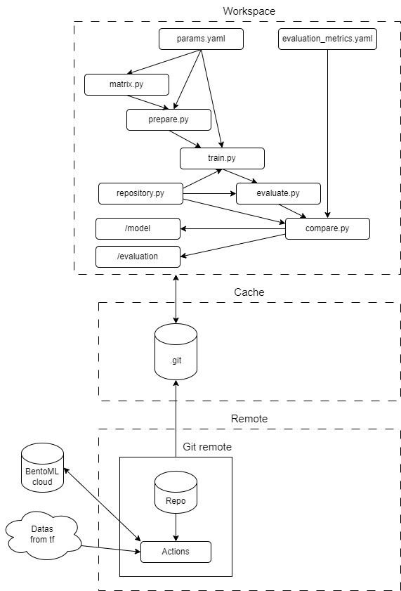

# Image Classification Pipeline with CI/CD and model optimization using specific metrics - TSM_MachleData

This repository contains a complete machine learning workflow for training, evaluating, and deploying image classification models. It supports both custom architectures and pre-trained models, integrates CI/CD pipelines using GitHub Actions, and optimizes models using a customizable metric-based scoring system.

## Context
A company offers classification service using Cifar-100. Each client has specific requirements for accuracy, speed, computational cost, etc. A model needs to be retrained for each new client. It takes some time and resources to achieve this. At the moment, only the experience and the background of the developers save time by starting with models and parameters that partly correspond to the customer's needs. 

## Overview
The goal of this project is to accelerate the selection and training phase of a classification model. The complete system aims to implement the following solution to solve the problems defined by the use case.

1.	__The time needed to test different models__: implement a pipeline that allows testing different models at the same time
2.	__Changes in customer needs__: implement a modular evaluation system where client-specific needs are the metrics that guide the model tuning process.
3.	__The time needed to compare the different models trained__: implement a step that evaluates and compares the different trained models and selects the best model based on the metrics chosen by the user. It also can compare with the already trained models.
4.	__The absence of a memory of training already carried out__: keep in memory the already trained models with their hyperparameters and the result.

The project workflow :



## Features
- __Custom and Pre-trained Models__: Support for manually defined architectures and pre-trained models like EfficientNetB0.
- __GitHub Actions Integration__: Automates pipeline execution using a dynamic matrix strategy based on the number of defined models.

- __Evaluation Metrics__: Comprehensive metrics like accuracy, recall, F1-score and more.
- __Model Comparison__: Normalizes evaluation metrics to rank models and select the best one using the selected metrics and weights.
- __BentoML Integration__: Seamless saving, loading trained models.
- __Result report__ : create a report to summarize the training results

### Files organisation
```
+---.github   # GitHub actions file       
+---data        
+---evaluation
¦   ¦   .gitkeep
¦   ¦   report.html     # Report last training
¦   ¦   weighted_metrics_heatmap.png    # Heatmap last traing
¦   ¦   
¦   +---ev-modelBest    # Evaluation of the best model
¦          
+---image     # Image for the README
+---model     # Contain the list of all models and the best one
¦           
+---src
¦   ¦   compare.py      # Compares models using normalized scores to select the best one.
¦   ¦   evaluate.py     # Evaluates models and generates metrics and visualizations.
¦   ¦   martix.py       # Generates the GitHub Actions matrix for CI/CD.
¦   ¦   prepare.py      # Handles data preparation and preprocessing.
¦   ¦   report.py       # Create report from model evaluation
¦   ¦   repository.py   # Manages model storage, metadata, and inference.
¦   ¦   train.py        # Create, trains, and saves models.
¦   ¦   
¦   +---utils
¦
¦   .gitignore
¦   evaluation_metrics.yaml     # Defines metrics and weights for model evaluation.
¦   params.yaml                 # Configuration for data preparation, training, and model definitions.
¦   README.md
¦   report_tmp.html             # Report template
¦   requirements-freeze.txt
¦   requirements.txt
```

## Usage
1. Define metrics to evaluate and their weight in _evaluation_metrics.yaml_
2. Define configuration in _params.yaml_
3. Commit modification on GitHub to run the workflows (_.github/workflows/mlops.yaml_)
4. Compare result using _evaluation/report.html_
5. Repeat step 2 to 4 until needs are met
6. The best model is contain in _model/model-modelBest_